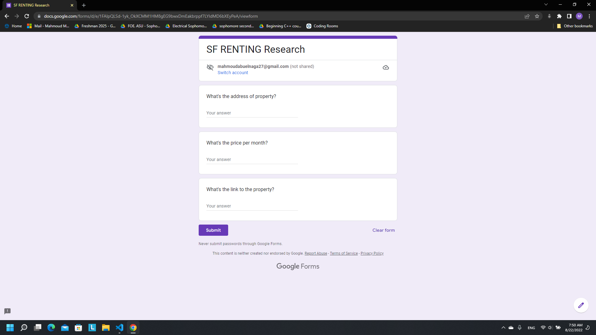
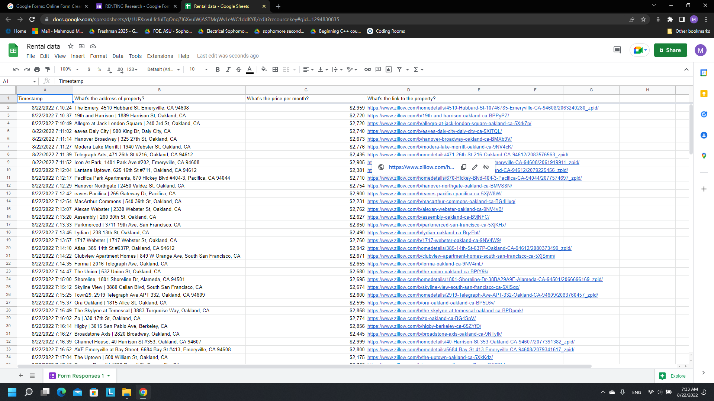

# Data Entry Automation

The program searches for appartments you can rent in San Francisco, CA on "https://www.zillow.com/" and fill a form with the data scraped from the website.

## Instructions

- This program was done using selenium module (make sure you got it installed to run the program)
- You need to install chrome driver for your current chrome version and provide its path in "chrome_driver_path" variable in both "formfiller.py" and "propertyfinder.py"
- Provide your chrome default profile path in "options.add_argument()" in "propertyfinder.py"
- If you want to search for an appartment somewhere else, go to "https://www.zillow.com/" adjust your search prefrences and provide the link of results page in "ZILLOW_RENTALS_PAGE" constant in "main.py"
- Create a form and provide its link to "FORM_LINK" constant in "main.py"
  - Note: Form need to be like this:
  
- Note: Make sure that all chrome windows are closed

## Demo

- Selenium scraping "https://www.zillow.com/"

- Selenium Filling the form

- Filled form

