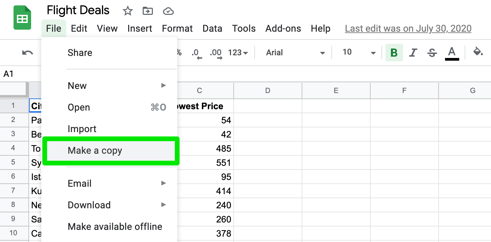
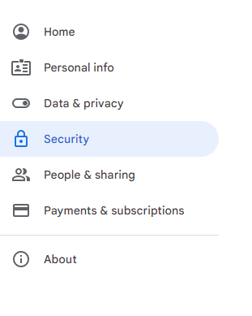
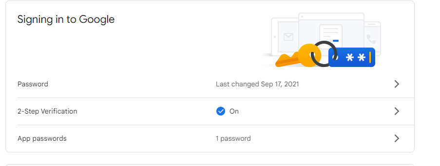
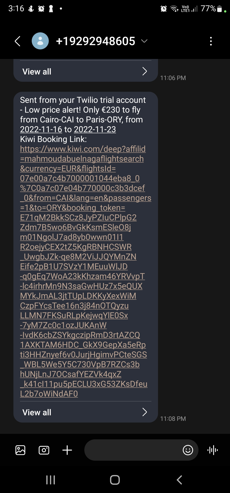
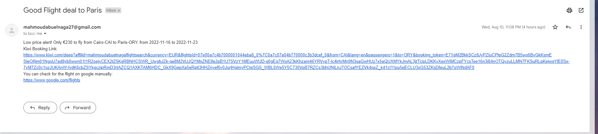

# Flight deal

## Description

The program checks for best flight deals from cairo to any of the following cities: Paris, Berlin, kuala Lumpur, New York...etc, where the flight price is lower than the average price.

## Instructions

### To run the program on your computer

- Install requests and twilio modules.
- Create Twilio account from this link: <https://www.twilio.com/try-twilio> and fill empty strings ("_____") with your authentication data in "notification_manager.py".
- Make a copy of the following spreadsheet: <https://docs.google.com/spreadsheets/d/1aRZyxz9vs9Sn8KS3D1CZ-u1wWyyaYgpG9I5glHL-WPE/edit#gid=0>

- Create an account on: <https://sheety.co/> with the google account that has the spreadsheet on its drive
  - Create a new project set its name: "Flight Deals" and paste your spreadsheet URL.
  - Allow get, put and post requests on both sheets.
  - Make a basic authentication key and copy your username and authentication key in the code constants of "data_manager.py".
- Create an account on: <https://tequila.kiwi.com/portal/login> and copy your API key in the empty string constant in "flight_search.py".
- Put your gmail in the NotificationManager class in "notification_manager.py" and create app password on your gmail and set it as the password in the same class.

  
  
- Get your city IATA code and set it as DEPARTURE_CITY_IATA_CODE and also change CITY_FROM constant in "main.py".
- Add the cities you want to visit in prices sheet and the emails you want to inform in the users sheet in "Flight Deals" spreadsheet.
- Note that: You should enter the "Average Price" in the prices sheet in Euro and the flight price currency sent in emails is also Euro.

## Screenshots

