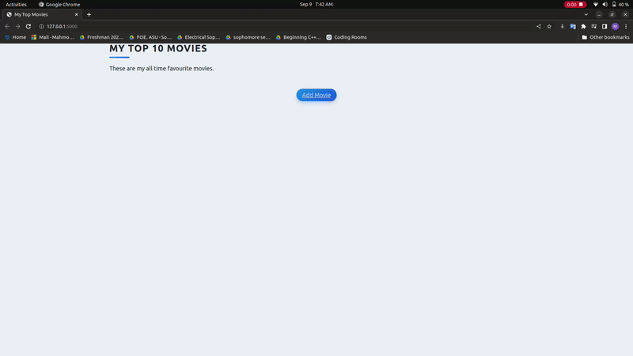

# My Top Movies Website
A website where you can add your favourite movies and give them a rating and review.

## Instructions
- Create an account on https://www.themoviedb.org/ , get your API key and set it as enviroment variable under the name of MOVIE_DB_KEY or set it as value for the constant MOVIE_DB_KEY in "main.py"
- Run the command "pip3 install -r requirements.txt" to install the required packages
- run "main.py"

## Demo

