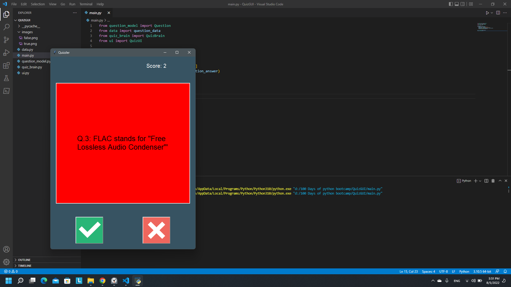

# Quiz GUI

## Instructions
- It gets 10 true or false questions from the Open Trivia DB and displays them.
- GUI turns green if you was correct or red otherwise, then displays a new question.

## Demo

