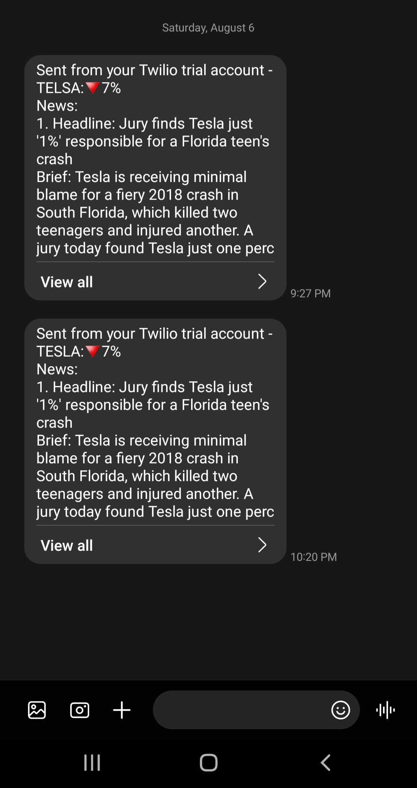
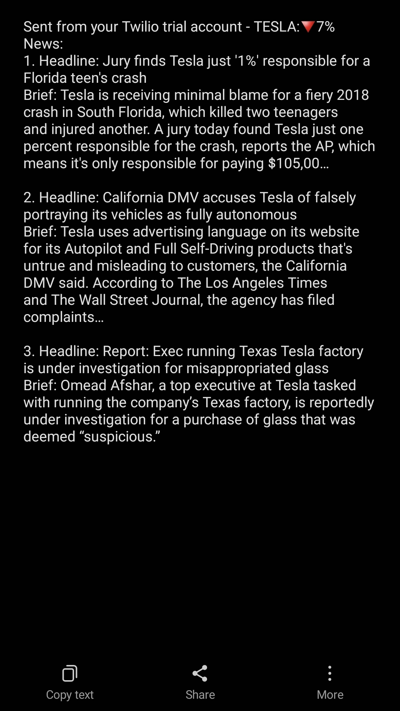

# Stock News

## Instructions
- The program checks the previous day and before previous day close value of stock of Telsa.
- If the percentage of change is greater than 5%. The program sends a message with the percentage of change of close value and the latest 3 news related to the company.
- In order to test the program you need to create an account and get your own api keys from the following sites:
    - https://www.twilio.com/
    - https://newsapi.org/
    - https://www.alphavantage.co/
- Then put the keys you got in the empty strings (constants) in the code or set them as enviroment variables.
- You can change the company you want to get information about it stocks by:
    - Changing (COMPANY_SYMBOL) to the value you want. Use the following link to search for the symbol of the company you want:
        - https://www.alphavantage.co/query?function=SYMBOL_SEARCH&keywords=tesco&apikey=demo
        - Replace the value of (keywords) with the company you are searching for its symbol.
        - Put your API key.
    - Changing (COMPANY_NAME).

## Demo

