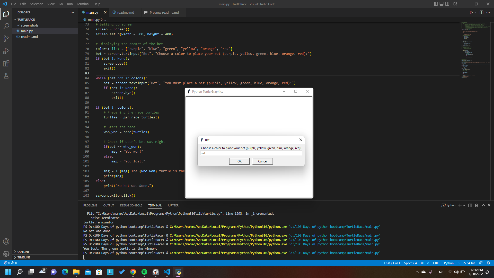
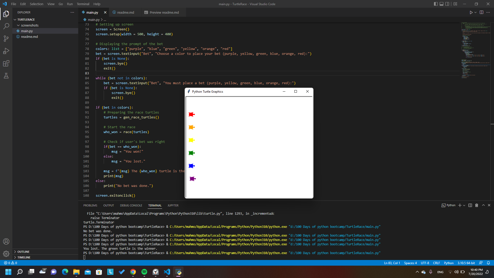
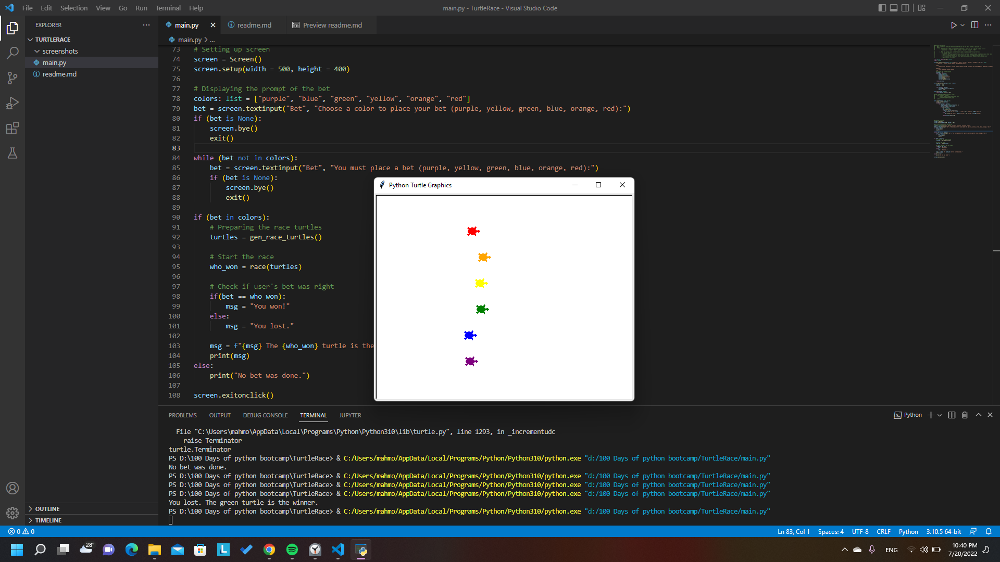

# Turtle Race Betting game
## Instructions
- Choose a color (purple, yellow, green, blue, orange, red) to bet on a turtle of the same color.
- Game ends when a turtle reaches the right end of screen.
- GUI/Console log whether you won or lost the game.
- If there is no bet console prints "No bet was done." and the game doesn't start.
## Modules used:
- Turtle module
- Random module

## Demo

