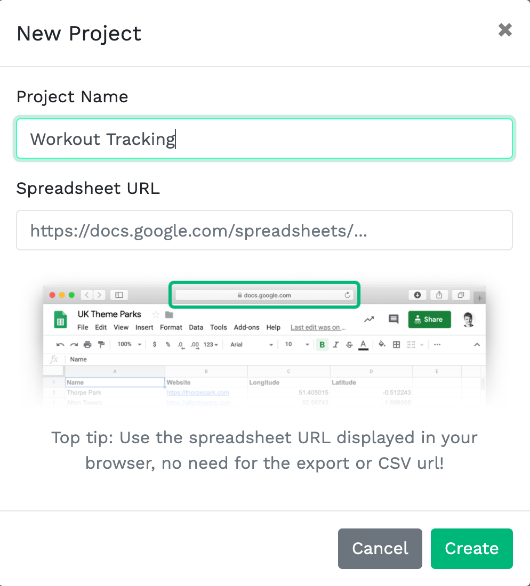
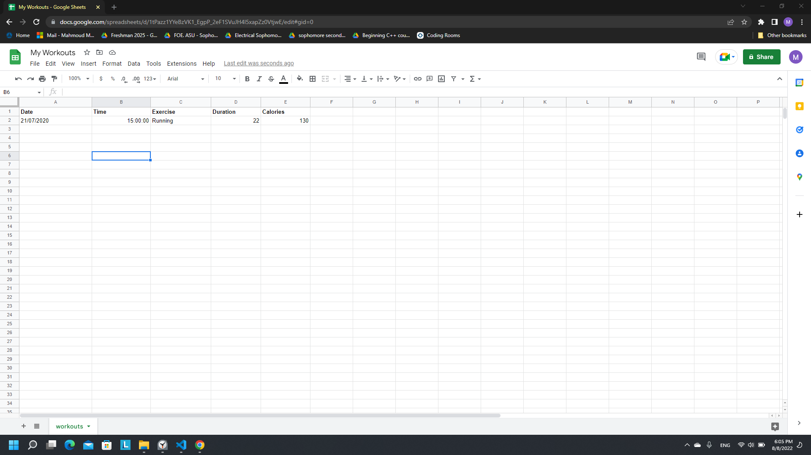
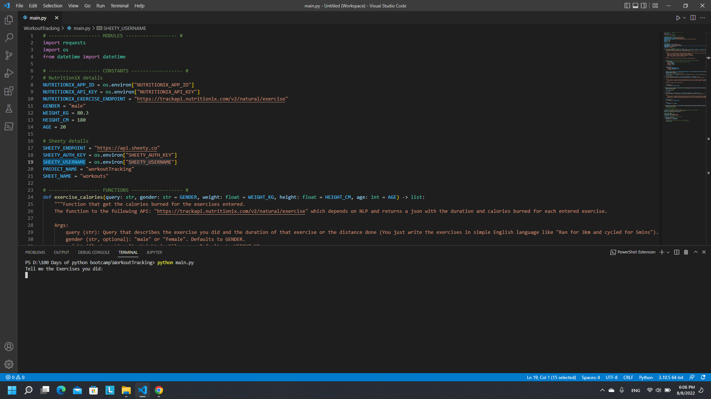
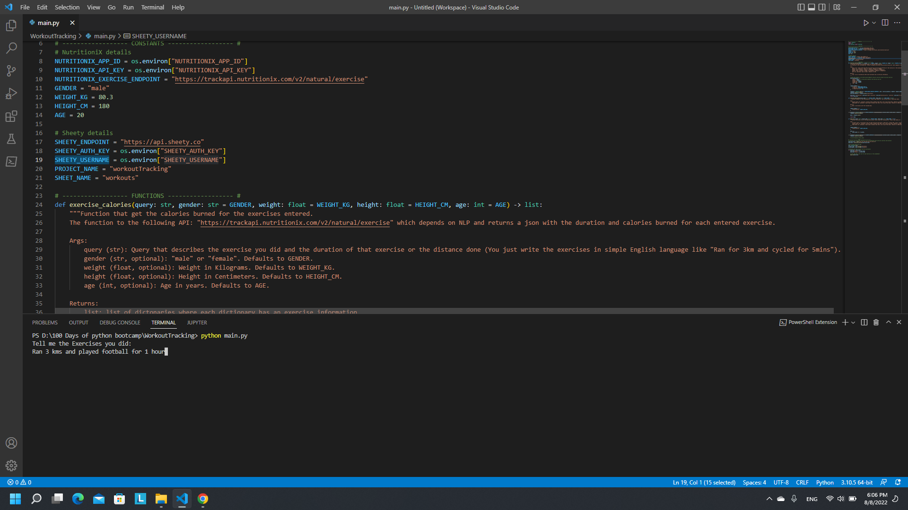
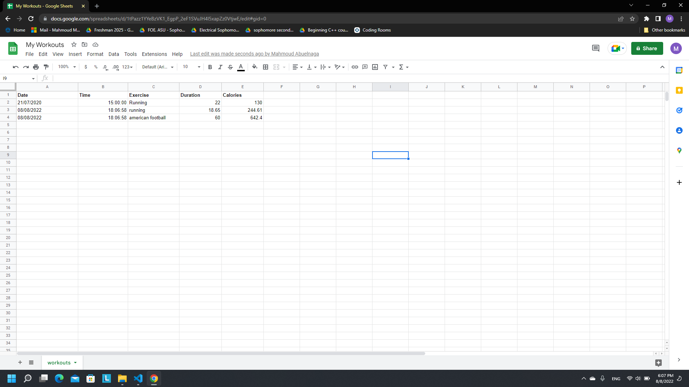

# Workout Tracking

## Instructions
- Install requests module.
- Copy the following spreadsheet: https://docs.google.com/spreadsheets/d/1DHL6Y8XAHSC_KhJsa9QMekwP8b4YheWZY_sxlH3i494/edit#gid=0
- Create an account on: https://www.nutritionix.com/business/api
    - Get your APP_ID and API_KEY
    - Set them as constants in the code.
- Create an account on: https://sheety.co/ with the google account that has the spreadsheet on its drive.
    - Create a new project set its name: "Workout Tracking" and paste your spreadsheet URL.
    
    - Allow get and post requests.
    - Make a basic authentication key and copy your username and authentication key in the code constants.

## Demo

