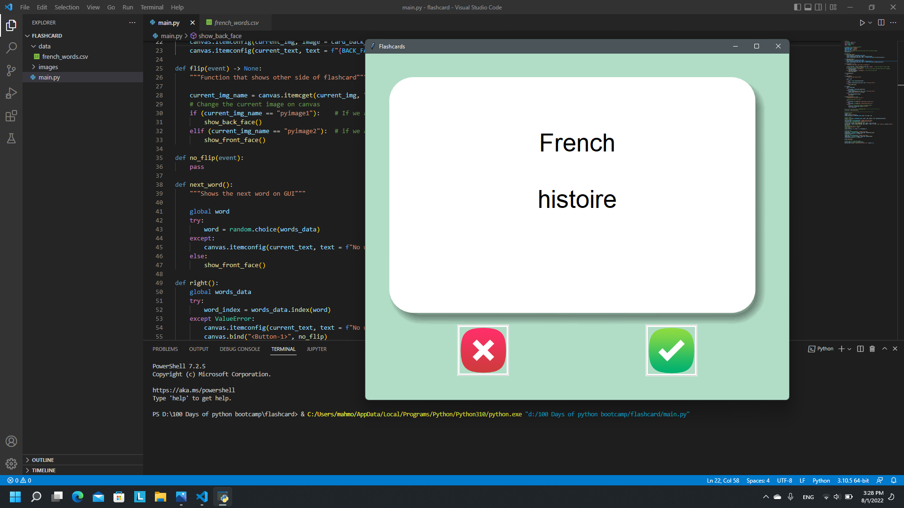
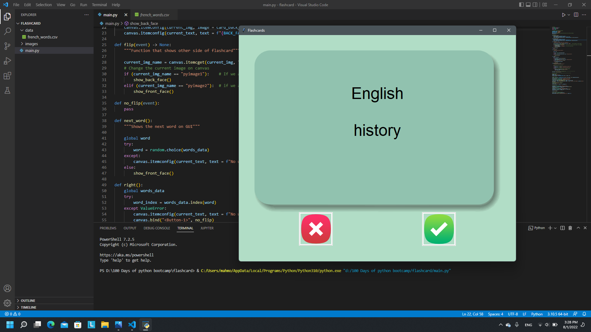
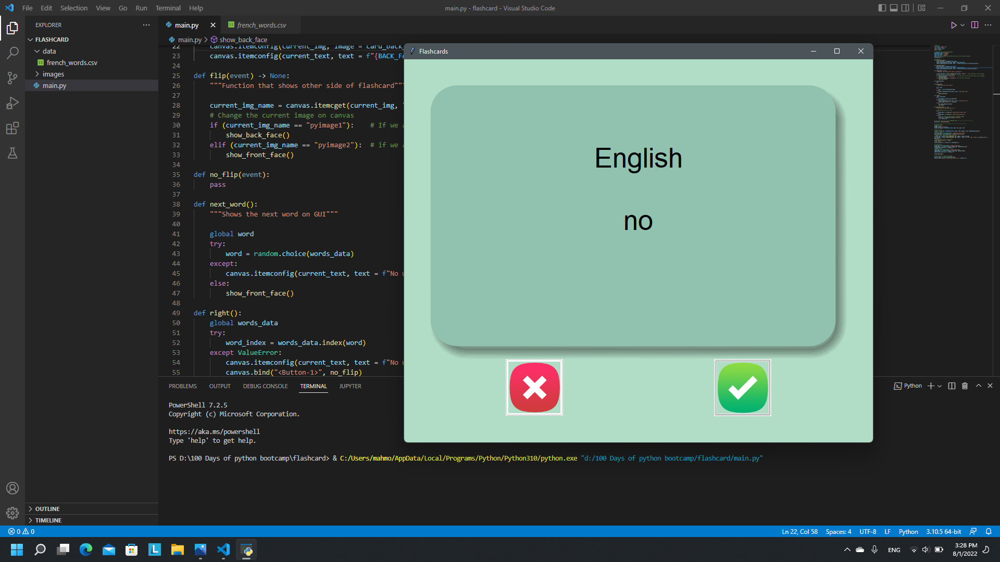
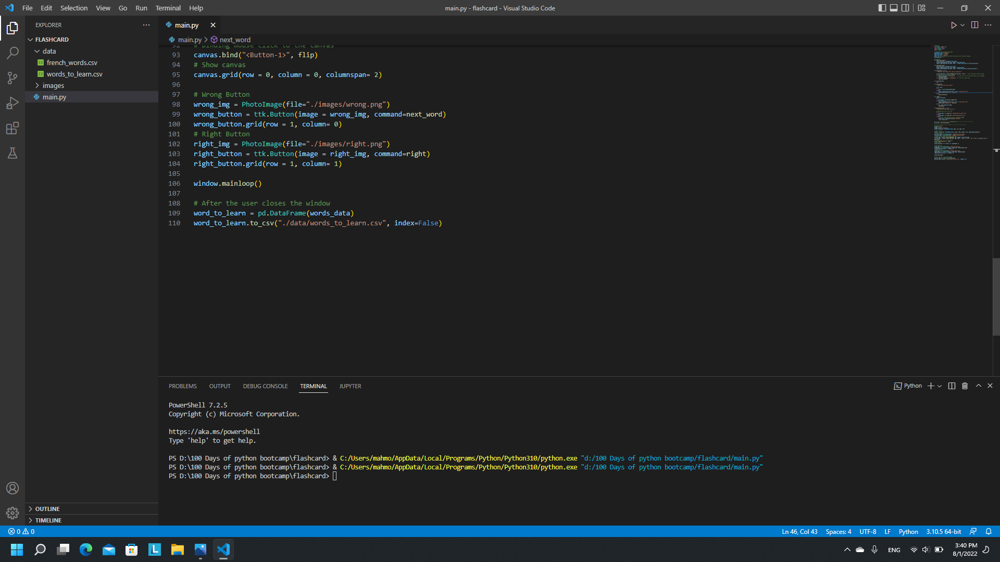

# Flashcards GUI

## Instructions
- French --> English cards to help you study french.
- Left click on the card to flip it to the other side.
- Left click "right" sign if you know the word or click "wrong" otherwise.
- When you exit the GUI a csv file of "words_to_learn" is created to review the words you didn't know.
- Next time you open the program, the flashcards are only those you didn't know.

## Demo

